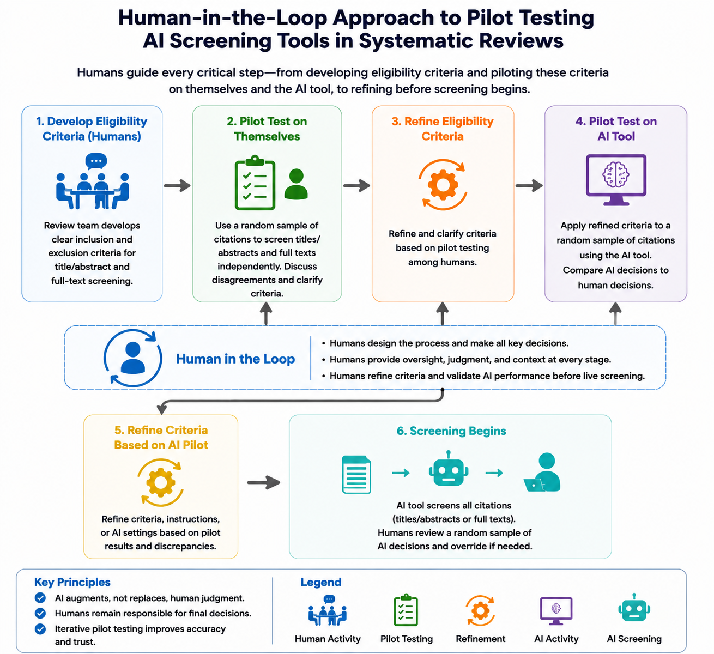

# AI versus Human Screening



## Overview

This repository contains the following files:

* Appendix D PNG file;
* CSV files from the screening process; and
* R programs

File contents are summarized below.

<br>

## Appendix D

1. Human-in-the-loop workflow .png file that is Appendix D in the manuscript (shown above)

<br>

## CSV Files

1. Catchii_Title_Abstract_Screening_Results.csv
2. Loon_Lens_Full_Text_Screening_Results.csv
3. Loon_Lens_Title_Abstract_Screening_Results.csv

These files contain the following information: article titles, authors, years of publication, journals, DOIs, whether the articles were included or excluded, reasons for inclusion or exclusion, and confidence levels for inclusion/exclusion decisions (Loon Lens only)

<br>

## R Programs

1. Confidence Concordance Regression: simple logistic regression of concordance on Loon Lens confidence scores;
2. Deduplication Script: use of R's ASySD library to remove duplicate citations obtained in the literature search;
3. Figure 3: generation of forest plots to show reliability statistics for title and abstract screening; and
4. Full Text Screening Comparison: all analyses for the full-text comparison of Loon Lens versus human screening, except confidence-concordance regression

*Please note:* for title and abstract screening analyses, we utilized the same code as shown in the Full_Text_Screening_Comparison.R file.

<br>

## Python Code

This Python code generates Figure 3 from the manuscript.

```python
# ============================================================
#  Forest Plots – Figure 3 (Title & Abstract Screening)
#  AI vs. Human Screening in Systematic Reviews
#
#  Python reproduction of the original R/ggplot2 script.
#
#  Layout: 3 plots stacked in one column
#          Each plot has its own y-axis (full stat names)
#          Shared x-axis at bottom only
#          X-axis: 0.25 to 1.00 by 0.25
#          Labels (est + 95% CI) above each point estimate
#          Boxes (point estimates) half-size filled squares
#          Font: Arial throughout
#
#  Required packages:
#    pip install matplotlib
# ============================================================

import matplotlib
import matplotlib.pyplot as plt
import matplotlib.patches as mpatches
import matplotlib.ticker as ticker
import numpy as np

# Use Arial if available, otherwise fall back to sans-serif
matplotlib.rcParams['font.family'] = 'Arial'

# ── 1. DATA ──────────────────────────────────────────────────
stat_labels = [
    "Sensitivity",
    "Specificity",
    "Positive Predictive Value",
    "Negative Predictive Value",
    "Concordance",
    "Kappa",
    "F1 Score",
]

# y positions (0 = bottom = Sensitivity, 6 = top = F1 Score)
y_pos = list(range(len(stat_labels)))

def make_data(est, lo, hi):
    labels = [f"{e:.2f} ({l:.2f}, {h:.2f})" for e, l, h in zip(est, lo, hi)]
    return {"est": est, "lo": lo, "hi": hi, "labels": labels}

data_a = make_data(
    est=[0.49, 0.96, 0.52, 0.96, 0.93, 0.46, 0.50],
    lo =[0.37, 0.95, 0.38, 0.94, 0.91, 0.34, 0.39],
    hi =[0.63, 0.98, 0.66, 0.97, 0.94, 0.59, 0.61],
)

data_b = make_data(
    est=[0.66, 1.00, 0.91, 0.97, 0.97, 0.75, 0.76],
    lo =[0.54, 0.99, 0.81, 0.96, 0.96, 0.65, 0.66],
    hi =[0.77, 1.00, 0.98, 0.98, 0.98, 0.84, 0.84],
)

data_c = make_data(
    est=[0.41, 0.97, 0.55, 0.96, 0.93, 0.44, 0.47],
    lo =[0.29, 0.96, 0.39, 0.94, 0.91, 0.30, 0.34],
    hi =[0.56, 0.98, 0.69, 0.97, 0.95, 0.56, 0.59],
)

panels = [
    (data_a, "Catchii vs. Human",     "A", False),
    (data_b, "Loon Lens vs. Human",   "B", False),
    (data_c, "Loon Lens vs. Catchii", "C", True),
]

# ── 2. AXIS SETTINGS ─────────────────────────────────────────
x_min    = 0.25
x_max    = 1.05
x_breaks = [0.25, 0.50, 0.75, 1.00]
x_labels = ["0.25", "0.50", "0.75", "1.00"]

# ── 3. FIGURE SETUP ──────────────────────────────────────────
fig, axes = plt.subplots(
    nrows=3, ncols=1,
    figsize=(8.5, 11),
    sharex=True,
)

fig.subplots_adjust(hspace=0.18, left=0.30, right=0.97, top=0.97, bottom=0.07)

# ── 4. DRAW EACH PANEL ───────────────────────────────────────
for ax, (data, title, tag, is_bottom) in zip(axes, panels):

    est    = data["est"]
    lo     = data["lo"]
    hi     = data["hi"]
    labels = data["labels"]

    # Dashed vertical gridlines at x breaks
    for xb in x_breaks:
        ax.axvline(xb, color="grey", linewidth=0.4, linestyle="--", zorder=0)

    # Solid vertical line at x = 1.0
    ax.axvline(1.0, color="#999999", linewidth=0.5, linestyle="-", zorder=1)

    # Horizontal error bars
    for i, (e, l, h) in enumerate(zip(est, lo, hi)):
        ax.plot([l, h], [i, i], color="black", linewidth=0.8, zorder=2)
        # Whisker caps
        ax.plot([l, l], [i - 0.10, i + 0.10], color="black", linewidth=0.8, zorder=2)
        ax.plot([h, h], [i - 0.10, i + 0.10], color="black", linewidth=0.8, zorder=2)

    # Filled square point estimates
    ax.scatter(est, y_pos, marker="s", s=18, color="black", zorder=3)

    # Labels above each point estimate
    for i, (e, lbl) in enumerate(zip(est, labels)):
        ax.text(
            e, i + 0.30, lbl,
            ha="center", va="bottom",
            fontsize=7, color="black",
            fontfamily="Arial",
        )

    # Y-axis
    ax.set_yticks(y_pos)
    ax.set_yticklabels(stat_labels, fontsize=10, color="black")
    ax.set_ylim(-0.9, len(stat_labels) - 0.2)
    ax.tick_params(axis="y", length=0)   # no tick marks on y

    # X-axis (only on bottom panel)
    ax.set_xlim(x_min, x_max)
    ax.set_xticks(x_breaks)
    if is_bottom:
        ax.set_xticklabels(x_labels, fontsize=9, color="black")
        ax.set_xlabel("Statistic (95% Confidence Interval)", fontsize=10, labelpad=6)
        ax.tick_params(axis="x", length=4, color="black")
    else:
        ax.tick_params(axis="x", length=0)

    # Spine styling: keep left and bottom only (classic theme)
    ax.spines["top"].set_visible(False)
    ax.spines["right"].set_visible(False)
    ax.spines["bottom"].set_visible(is_bottom)
    ax.spines["left"].set_color("black")
    if is_bottom:
        ax.spines["bottom"].set_color("black")

    # Panel title (bold, centred)
    ax.set_title(title, fontsize=11, fontweight="bold", color="black", pad=4)

    # Tag (A / B / C) — top-left inside axes
    ax.text(
        0.01, 0.97, tag,
        transform=ax.transAxes,
        fontsize=13, fontweight="bold", color="black",
        va="top", ha="left",
        fontfamily="Arial",
    )

    # Light background
    ax.set_facecolor("white")

fig.patch.set_facecolor("white")

# ── 5. SAVE ──────────────────────────────────────────────────
plt.savefig("Figure_3.png", dpi=900, bbox_inches="tight", facecolor="white")
print("Saved: Figure_3.png")
plt.show()
```

### END OF PROGRAM ### the AI versus human screening project.
